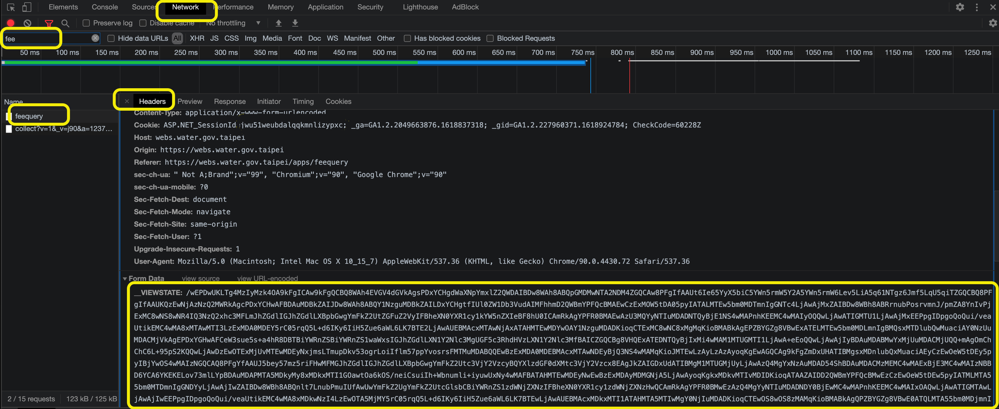

Home assistant support for ShinTao Gas Fee

[The readme in Traditional Chinese](https://github.com/tsunglung/ShinTaoGasFee/blob/master/README_zh-Hant.md).

The method was provided by [Jason Lee](https://www.dcard.tw/@jas0n.1ee.com).

***User the integration by your own risk***

## Install

You can install component with [HACS](https://hacs.xyz/) custom repo: HACS > Integrations > 3 dots (upper top corner) > Custom repositories > URL: `tsunglung/ShintaoGasFee` > Category: Integration

Or manually copy `shintaogas_fee` folder to `custom_components` folder in your config folder.

Then restart HA.

# Setup

You need to grab two tokens.

**1. Basic steps for grabbing**

1. Open the development tools (use Google chrome/Microsoft Edge) [Crtl+Shift+I / F12]
2. Open the Network tab
3. Open the [ShinTao Gas Fee Web site](https://www.shintaogas.com.tw/Home/service/online-bid.aspx), Query User History Data.
4. Search for "form" (for me only one itemes shows up, choose the first one)
5. Go to "headers" -> "from data"
6. copy the 3560 characters like "\wXXXXXXXXXXXX....=" in the field "\__VIEWSTATE:"  (mark with a mouse and copy to clipboard)
7. copy the 8 characters like "1EA234B5" in the field "\__VIEWSTATEGENERATOR:"  (mark with a mouse and copy to clipboard)
8. copy the 64 characters like "\wXXXXXXXXXXXX....=" in the field "\__EVENTVALIDATION:"  (mark with a mouse and copy to clipboard)

# Config

**2. Please use the config flow of Home Assistant**

1. With GUI. Configuration > Integration > Add Integration > ShintaoGas Fee
   1. If the integration didn't show up in the list please REFRESH the page
   2. If the integration is still not in the list, you need to clear the browser cache.
2. Enter Gas ID without dash.
3. Paste the viewstate, and generator token, validation eventvalidation into the indicated field, all fields are Required.

# Notice
The viewstate and generator tokens will expired after hours. If you saw the https_result is 403, you need get the new tokens again.
Then got to Configuration > Integration > ShinTaoGas Fee > Options, enter the info of tokens.

Buy me a Coffee

|  LINE Pay | LINE Bank | JKao Pay |
| :------------: | :------------: | :------------: |
|   |   |   |